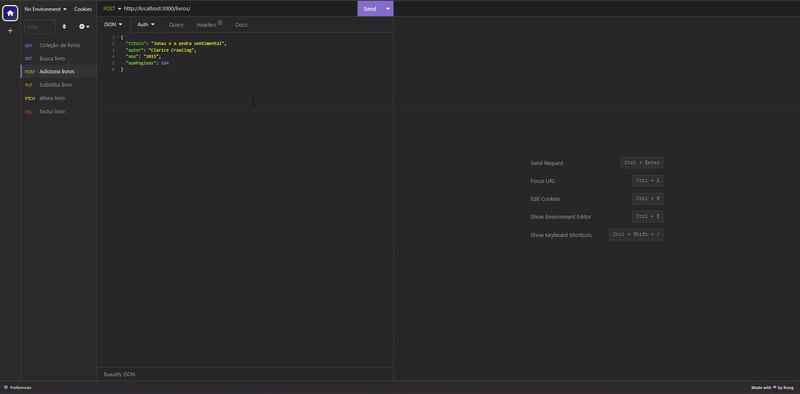
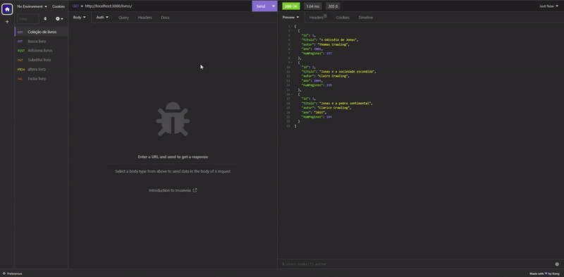
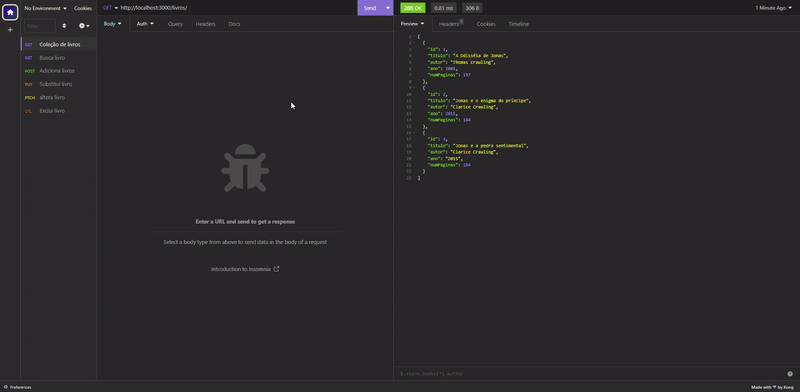
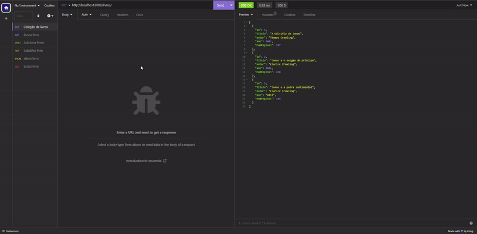

# Projeto de uma biblioteca

## Sobre:

Sistema de gerenciamento de uma biblioteca física com operações CRUD, desenvolvida com a linguagem Javascript, capaz de realizar as seguintes funções:

- Listar todos os livros;
- Buscar um livro;
- Adicionar novo livro;
- Substituir livro;
- Editar livro;
- Excluir livro.

 

## Listar todos os livros:

São listados todos os livros da biblioteca.

## Buscar um livro:

Encontra um determinado livro, pela ID.

## Adicionar novo livro:

Adiciona novo livro à coleção da biblioteca, e uma ID é atribuída automaticamente.

## Substituir livro:

Substituir um livro por outro, mantendo a ID do livro original.

## Editar livro:

Edita uma, ou mais, informações de um livro especificado por ID.

## Excluir livro:

Exclui um livro dos registros da biblioteca, especificado por ID.

 

## Tecnologias utilizadas:

- Javascript;

- Insomnia (para realizar testes no programa e fazer os gif's).